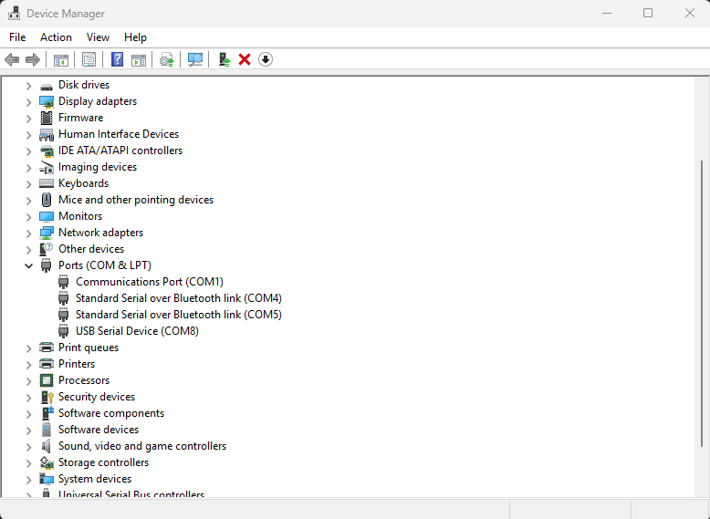
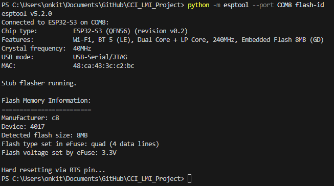
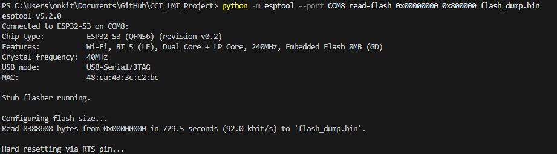
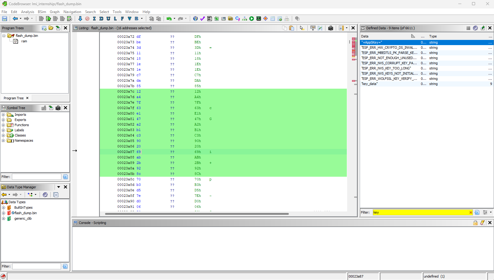
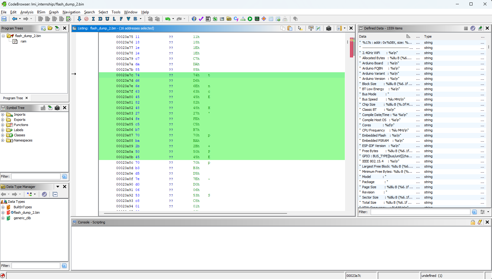
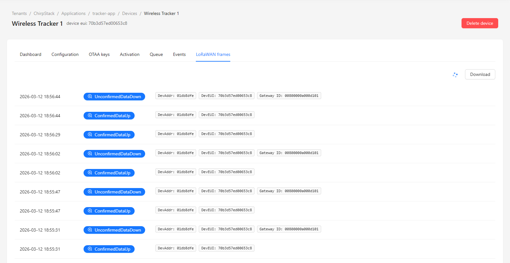
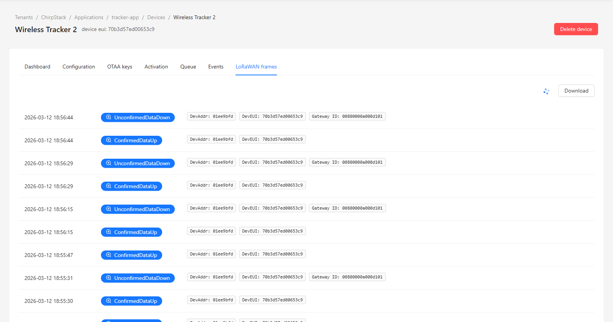
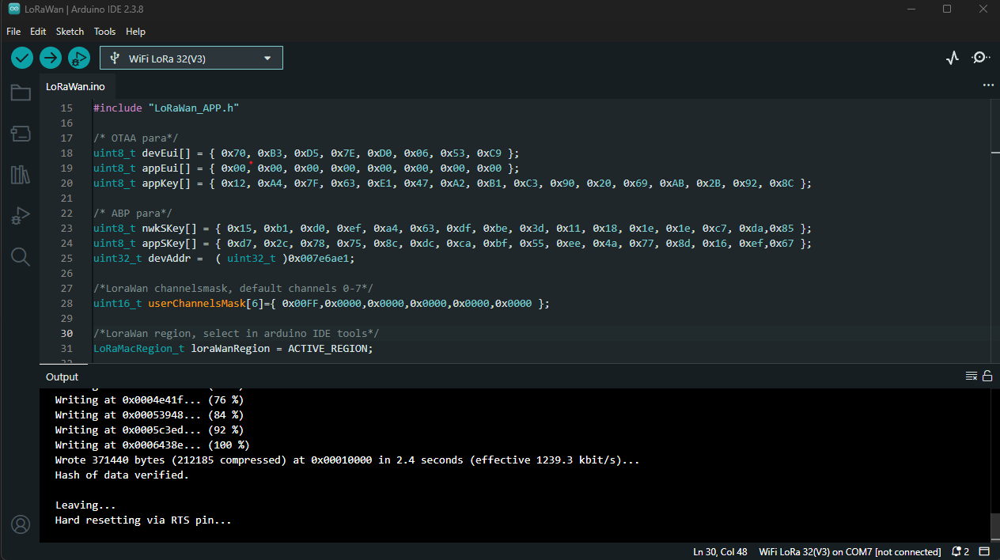

# Security Tests

## Vulnerabilities
LoRaWAN's cryptography is strong due to its use of AES-128, MIC validation, and session keys. Most of its weaknesses come from the implementation of LoRaWAN, specifically:
- Provisioning weaknesses
- Assumptions made about infrastructure trust
- Configuration errors

However, LoRaWAN implementations may be vulnerable to:
- Credential extraction
- Device cloning from identical credentials
- Reusing DevNonce values
- Malicious gateway
- Frame counter (FCntUp / FCntDown) reset after power loss
- Join flooding

## Credential Extraction
Objective: Extract AppKey and DevEUI if they are stored in plaintext on the end devices with physical access. Determine whether the AppKey is extractable from the firmware or if firmware readout is possible. 

### Setup:
1. Connect the end device to laptop.
2. Dump device's flash memory with esptool.py.
4. Identify the serial port using `mode`, for me it was COM8

  
5. Dump the entire flash.
```bash
# First detect boot size
python -m esptool --port COM8 flash-id
# Then dump flash, my detected flash size was 8mb so I used 0x800000
python -m esptool --port COM8 read-flash 0x00000000 0x800000 flash_dump.bin
```

This was my output:  
  

3. If the dump is successful, find the AppKey and DevEUI. In my case, the dump was successful:
  
However, I needed to look through the binary file that was generated. I chose to use Ghidra since it is a well-known software reverse engineering framework. 
I opened Ghidra and searched for the AppKey that I used when I configured the AppKey using Arduino:
  
The AppKey, as well as the devEui and appEui were all stored in plaintext. After finding the specific address where these were found, I dumped the other device's flash memory and found that the keys were also stored in plaintext in the exact same addresses as before, which is a serious security vulnerability.  
 


## Device Cloning
Objective: Ensure that LoRaWAN has protection against cloned identities, specifically devices with the same DevEUI and AppKey. 

Before setup, I made sure to capture packets of legitimate traffic as a baseline to compare to for this test. Below are screenshots of the logs in ChirpStack for both wireless trackers.
 
 
There are many instances of Confirmed Data Up, which means that the device sends packets and expects an ACK from the network server. There are also a few instances of Unconfirmed Data Down, which means that the server sent a downlink without requiring the device tto acknowledge it. This is the default for downlinks because it saves batery and airtime. The MultiTech Gateway was set up as a packet forwarder, which means it does not enforce reliability rules. 

After the baseline was done, I flashed identical credentials on the devices using these steps. 

### Setup:
1. Flash identical credentials on two end devices using the C++ file in this folder. The AppKey, DevEUI, and AppEUI are all the same. 
 
2. Power on both devices with batteries. 
3. Attempt to authenticate over the air on both devices, this is done automatically from the C++ program.
4. Observe if the server validates each device, or if any error logs are generated.


## DevNonce Handling
Objective: Make sure that the network server rejects reused DevNonce values during Over The Air Authentication (OTAA). Specifically, demonstrate that LoRaWAN has replay protection to prevent reused DevNonce values.

### Setup:
In order to target the join procedure between an end-device and the COTS gateway:
1. Capture the join request through the network server logs, specifically recording DevEUI, DevNonce, and JoinEUI.
2. Force the device to reboot without incrementing the DevNonce. Modify the firmware to send the same DevNonce as the last join request.
3. Transmit the join request with the DevNonce.
4. Observe if the network server accepted or rejected the request.

## Malicious Gateway
Objective: Figure out if a malicious gateway that pretends to be legitimate can alter traffic from an end device to a real gateway.

### Setup:
1. Deploy both gateways, connect them to the same ChirpStack server.
2. Configure the Pi gateway to modify RSSI values, drop packets, and inject latency.
3. Observe if the server recieves the traffic as legitimate. 

## Frame Counter Persistence
Objective: Determine whether the end device persists FCntUp across power cycles, and correctly resumes session state after being rebooted. LoRaWAN prevents replay attacks with FCntUp, an uplink frame counter, and FCntDown, a downlink counter. If FCntUp resets to 0 after power is lost, it could lead to the server rejecting packets, battery drain, or the device may become unavailable. 

### Setup:
1. Let the device reach a stable FCntUp.
2. Physically disconnect power and wait 10-20 seconds.
3. Restore power.
4. Observe the next uplink, and whether the server resumes count of the uplink, or resets.

## Join Flooding
Objective: Evaluate whether the LoRaWAN network (gateway + ChirpStack server) is resilient against excessive or malicious join attempts that attempt to exhaust network resources. Specifically, determine whether repeated OTAA Join Requests can:
- Degrade network server performance
- Prevent legitimate devices from successfully joining

### Setup:
1. Configure one end device to repeatedly send OTAA join requests by modifying its firmware
2. Have one other end device join legitimately
3. Observe logs on server to check if the device that was joining legitimately could join, or if the other device prevented it from joining

## Resilience to Malformed Frames
Objective: Make sure malformed frames do not crash the gateway or server.

### Setup:
1. Modify the end device's firmware to send an invalid MIC or corrupted MAC commands.
2. Observe how the gateway and server handle the malformed frames, whether they crash or if memory leaks occur. 

## Mapping Vulnerabilities with STRIDE
| STRIDE Category  | LoRaWAN Vulnerability | Technical Impact |
| ------------- | ------------- | ------------- |
| Spoofing | Device Cloning | Devices with identical credentials as another authorized device and cause frame counter conflicts or cause DoS through identity collision |
| Tampering  | Comprimised Gateway | A rogue gateway can interfere with packets that end devices send to the server |
| Information Disclosure  | Credential Extraction | Through physical access to an end device, the AppKey and DevEUI may potentially be extracted if they are stored in plaintext on the device |
| Denial of Service (DoS)  | Join Flooding | By transmitting many fake join requests, it prevents authorized devices from joining and sending legitimate traffic |
| Elevation of Privilege | Network Server/API Misconfiguration | Attacker gains administrative access to the server, which allows them to register devices, modify keys, and disable security checks |